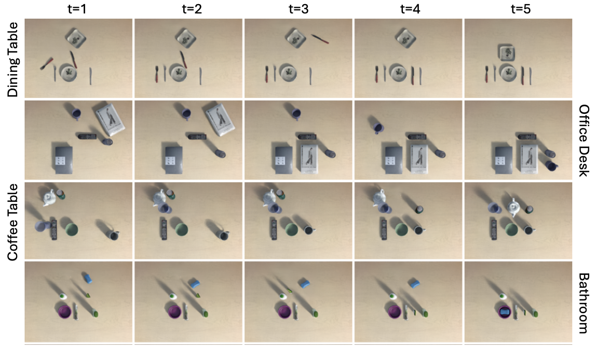

# Tabletop Tidying Up (TTU) Dataset

## About The Dataset

## Download

You can download TTU dataset from the URL below:

https://drive.google.com/drive/folders/1IfoVZwOTbjoapbo2uRAHHm0loH1GONUZ

The driver contains the files below: 

**train_B.tar.gz**, **train_C.tar.gz**, **train_D.tar.gz**, **train_O.tar.gz**,
**test_SU.tar.gz**, **test_US.tar.gz**, **test_UU.tar.gz**

After downloading all the compressed files, uncompress the datasets using the command below:
    
    $ source untar.sh

## Data Structure
  
    TTU_dataset/
      ├── train/
      │     └── {scene_id}/                          # scene_id:         (B1, B2, …, C1, C2, …, D1, D2, …, O1, O2, …)
      │         └── template_{template_num}/         # template_num:     (00001 ~ 00016)
      │             └── traj_{trajectory_num}/       # trajectory_num:   (00000 ~ 00099)
      │                 └── {frame_num}/             # frame_num:        (000 ~ 004)
      │                     ├── rgb_top.png
      │                     ├── rgb_front_top.png
      │                     ├── depth_top.npy
      │                     ├── deoth_front_top.npy
      │                     ├── seg_top.npy
      │                     ├── seg_front_top.npy
      │                     └── obj_info.json
      ├── test-seen_obj-unseen_template/
      │     └── ...
      ├── test-unseen_obj-seen_template/
      │     └── ...
      └── test-unseen_obj-unseen_template/
            └── ...

    
<!-- CONTACT -->
## Contact

Hogun Kee - hogun.kee@rllab.snu.ac.kr

Wooseok Oh - wooseok.oh@rllab.snu.ac.kr

## Citation

If you find our dataset useful in your research, plase cite:

    @misc{Kee_TTU_Dataset_Dataset_2024,
        author = {Kee, Hogun and Oh, Wooseok},
        month = sep,
        title = {{TTU Dataset: Dataset for Tabletop Tidying Up Problem}},
        url = {https://github.com/rllab-snu/TTU-Dataset/},
        year = {2024}
    }

<!-- LICENSE -->
## License

Distributed under the MIT License. See `LICENSE` for more information.

